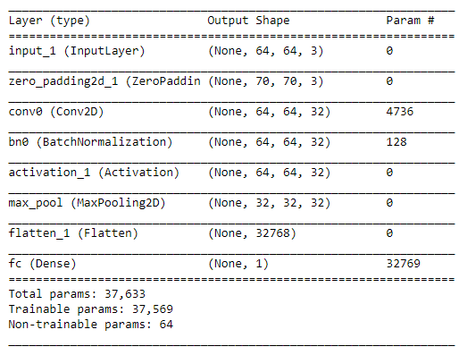
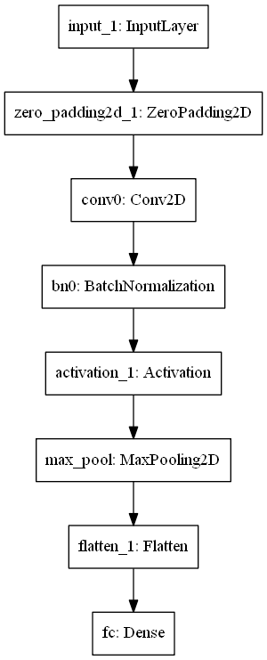

#### Keras Tutorials from Andrew Ng's deeplearning.ai  
TO run:  
  
python main.py  

Train Loss = [  7.48216116e-05]  
Train Accuracy = [ 0.99999774]  

Test Loss = [ 1.]  
Test Accuracy = [ 0.99998879]  

##### Model Summary #####
  

##### Model Summary #####
  
  
